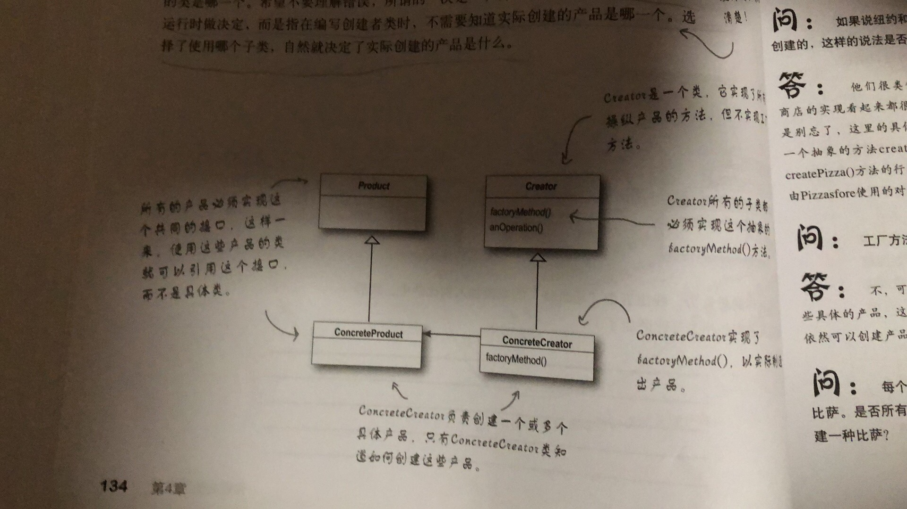
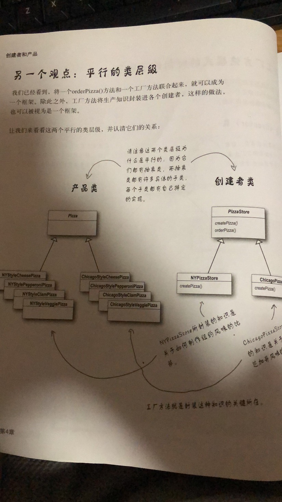

工厂模式
===

### 问题描述：
开Pizza店售卖多种Pizza， 其中Pizza会在NYC，芝加哥有加盟店，各地做法和原料略有不同

### 初步设计：
简单的会设计一个orderPizza
```
Pizza orderPizza(type)
    Pizza pizza
    if type == cheesePizza:
        pizza = cheesePizza
    else if ..
        ...
    
    pizza.prepare()
    pizza.cut()
    pizza.box()
    return pizza 
```

可以看到，根据之前所讲的原则，会将这一部分提出来，做一个HAS_A关系处理，因为
不像针对实现编程，会将这里针对接口编程。所以要减少依赖，减少隅合。

```
    Pizza pizza
    if type == cheesePizza:
        pizza = cheesePizza
    else if ..
        ...
```

那么简单的将其提成一个createPizza()， 原函数委派一个对象SimplePizzaFactory进行
动态的调用。 这样子会又一个问题， 前文所述，不同的加盟店会有不同的处理方式，在box()，cut()
等方面都会不同，简单的委派不能实现对原函数的变化和更改，所以这里需要用工厂模式解决。

即如PizzaStore.java中所写
```
   protected abstract Pizza createPizza(String type);
```
这样做，允许子类做决定，也符合事实逻辑，pizzastore的不同分店做法不同，则客户选择了某一分店，即
原店的子类，而由子类决定父类中的做法，这里就会对父类中的做法等函数进行重写。而
对应的，实例化完全放在了子类中进行，父类不需要考虑实现，因此可以自由的对父类进行扩展。

####__工厂方法模式__
> 定义了一个创建对象的接口，但由子类决定要实例化的类是哪一个。工厂方法让类把实例化推迟到子类。

"工厂模式简易结构"


"创建类和产品类结构"


"并列关系"


当使用之前设计时，所有的实现都放在了orderPizza中进行，也就造成在PizzaStore这个类中
依赖关系复杂，PizzaStore依赖于各种个样的Pizza种类(NYStyleCheesePizza, ChicagoStyleCheesePizza, NYStyleClamPizza....)
代码需要减少对具体类的依赖，所以我运用一个新的设计原则

    PS: 依赖一般的体现为继承和new（对下依赖）， 实现（implement）（对上依赖）

####__设计原则__
> 要依赖抽象，不要依赖具体类

类似于针对接口而不是实现编程，这里主要强调，不能让高层组件依赖底层组建，而且不论是高层还是底层，都应该依赖于抽象
所以在使用工厂模式后，底层的依赖全部倒置，依赖于Pizza

"倒置依赖"


尽量遵守以下三个方针，避免违反依赖倒置原则
+ 变量不可以持有具体的引用
+ 不要让类派生自具体类
+ 不要覆盖基类中已实现的方法

### 进一步设计

引入原料问题， 不同地区的加盟店所用原料不同(ingredient)
   
    eg:
        NYC : 
         Fresh Clam, MarinarSauce, ThinCrushDough, ReggianoCheese
        
        Chicago:
         Frozen Clam, PlumTomatoSauce, ThickCrustDough, MozzarellaCheese
         
     
为解决这个问题，我们引入一个原料工厂，他是一个抽象的工厂，类似于之前提到过的简单工厂，但他是一个抽象的接口

通过抽象工厂的接口，不同原料选择的代码从实际工厂中解隅，替换不同的工厂引入不同的原料。

####__抽象工厂模式__
> 提供一个接口，用于创建相关或者依赖对象的家族，而不需要明确制定具体类
>
>抽象工厂允许客户使用抽象的旧口来创建一组相关的产品，而不需要知道实际产出的具体产品是什么。这样，客户就从具体的产品中被解隅。
>
           
"工厂方法和抽象方法对比1"

"工厂方法和抽象方法对比2"

###要点：

1. 所有的工厂都是用来封装对象的创建
2. 抽象工厂使用对象组合：对象的创建被实现在工厂接口所暴露出来的方法中。
3. 所有工厂模式都通过减少应用程序和具体类之间的依赖促进送隅合。
4. 工厂方法允许类将实例化推迟到子类中进行
5. 抽象工厂创建相关的对象家族，而不需要依赖他们的具体类，
 